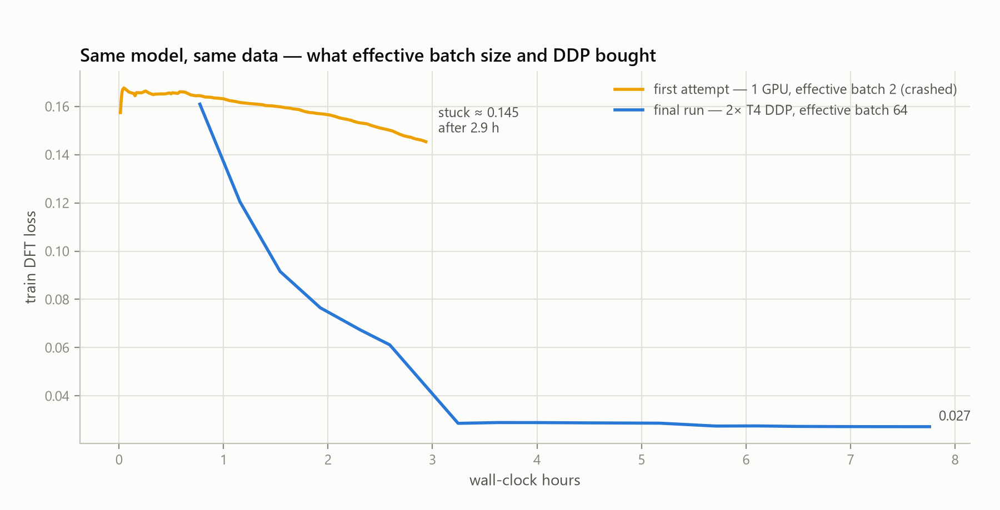
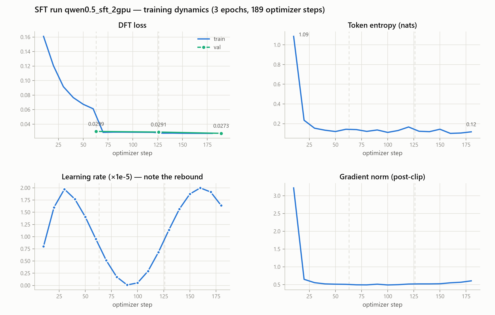
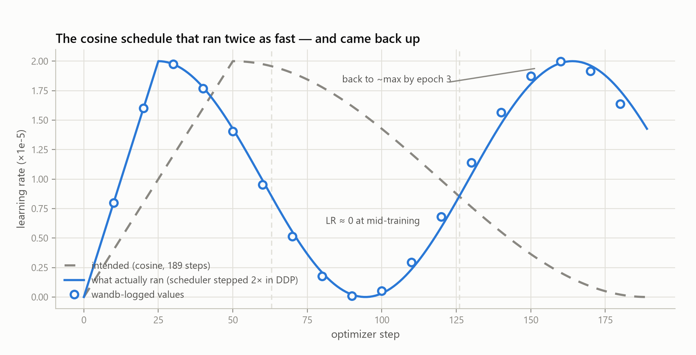
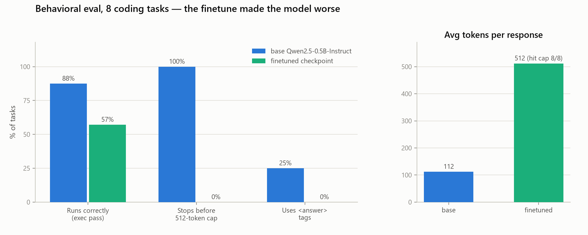

# My loss curve said 0.027. My model wouldn't stop talking.

*A finetuning post-mortem: SFT on Qwen2.5-0.5B with DFT loss, free Kaggle T4s, a wandb dashboard that said everything was fine — and a behavioral eval that said the opposite. This is the full story, bugs included, because the bugs turned out to be the interesting part.*

---

## The idea

I wanted a small model that fixes code issues *with visible reasoning*. The plan:

- **Model**: `Qwen/Qwen2.5-0.5B-Instruct` — small enough to train full-parameter on free hardware and iterate fast.
- **Data**: ~10k coding problems (OpenCodeReasoning-style), each response formatted as `<think> step-by-step reasoning </think><answer> runnable code </answer>`. The tags are added to the tokenizer as special tokens so the format is a first-class part of the vocabulary.
- **Loss**: [DFT — Dynamic Fine-Tuning](https://huggingface.co/papers/2508.05629), an RL-inspired rectification of SFT. Instead of plain cross-entropy, each token's loss is weighted by the model's own probability for that token:

  ```python
  per_token_loss = -logprobs.exp().detach() * logprobs   # -p(y|x) · log p(y|x)
  ```

  The paper's framing: SFT is policy gradient with an implicit `1/p` importance weight that over-rewards low-probability tokens; multiplying by `p` rectifies the reward and improves generalization.
- **Infra**: my own trainer (`src/trainers/custom/train_sft.py`) — DDP via `accelerate`, cosine LR schedule, gradient accumulation/checkpointing, wandb + mlflow logging, resumable checkpoints — running on Kaggle's free 2× T4.

The pipeline is the point of the project as much as the model: I wanted to own every step from raw data to a checkpoint I could interrogate.

## Part 1 — getting a run to finish at all

The first attempt ([`ug94ujsd`](https://wandb.ai/New_103/my_sft_project_v3)) ran on a single GPU with `batch_size=1`, `max_length=5120`, `gradient_accumulation=2` — an **effective batch of 2**. The loss curve barely moved for three hours, and then the run crashed before finishing epoch 1.



Getting from the orange line to the blue one took a string of unglamorous fixes (all in the git history):

1. **`notebook_launcher` → `mp.spawn`** — Kaggle notebooks had already initialized CUDA, and `notebook_launcher` forks, which raises `RuntimeError` with CUDA. `mp.spawn` with explicit `RANK`/`WORLD_SIZE`/`MASTER_ADDR` env vars fixed 2-GPU DDP from a notebook cell.
2. **OOM on 15 GB T4s** — batch/sequence-length tuning plus gradient checkpointing.
3. **bitsandbytes 4-bit is incompatible with DDP wrapping** — quantization off for multi-GPU.

The final run ([`jaml5ohf`](https://wandb.ai/New_103/my_sft_project_v3)): 2× T4, `batch_size=2` per GPU, `max_length=2048`, `grad_accumulation=16` → **effective batch 64**, 3 epochs, 189 optimizer steps, 7.8 hours. Train loss went 0.161 → 0.027; val loss improved every epoch (0.0299 → 0.0291 → 0.0273). The best checkpoint was zipped and pushed to Kaggle Models automatically.

## Part 2 — what the dashboard said



Read the classical way, these curves are a success story:

- **Loss** drops 6× and validation tracks training with no divergence — no overfitting signal after 3 epochs.
- **Token entropy** collapses from 1.09 → ~0.12 nats within the first epoch — the model becomes extremely confident about response tokens.
- **Gradient norm** settles at ~0.5 after warmup: stable optimization, no spikes.

But there was one curve that made no sense: the learning rate.

## Part 3 — the cosine schedule that shouldn't exist

Cosine decay with warmup should rise once, then decay monotonically to ~0 at the end of training. This is what wandb logged:



The LR peaked at step ~25 instead of 50, hit **zero halfway through training**, then climbed back to ~max during epoch 3.

The cause is a one-line trap in the trainer:

```python
self._setup_scheduler(total_optimizer_steps, completed_steps=global_step)  # 189 steps
if self.scheduler:
    self.scheduler = self.accelerator.prepare(self.scheduler)   # ← the bug
```

`accelerate`'s prepared scheduler steps the underlying scheduler **once per process** on every `scheduler.step()` call. With 2 GPUs the schedule advanced 2× per optimizer step, so a 189-step cosine finished at step ~94. And Hugging Face's `get_cosine_schedule_with_warmup` lambda doesn't clamp past `num_training_steps` — `0.5·(1+cos(π·progress))` for `progress > 1` **comes back up**. The model spent epochs 2–3 training at a *rising* learning rate.

The satisfying part: the "scheduler stepped 2×" hypothesis predicts the logged values exactly. At step 160 the compressed-cosine formula gives `1.98e-5`; wandb logged `1.999e-5`. Fix is one line — size the schedule in scheduler-steps, not optimizer-steps (or don't `prepare` the scheduler):

```python
self._setup_scheduler(total_optimizer_steps * self.accelerator.num_processes, ...)
```

This bug alone justifies logging `train/lr`. A loss curve hides it completely.

## Part 4 — the behavioral eval

A checkpoint with val loss 0.0273 *sounds* good, but the number is only meaningful against the same data distribution it was trained on. So I wrote `eval_checkpoint.py`: 8 coding tasks, greedy decoding, and three *behavioral* checks — does the output follow the `<think>/<answer>` format, does the extracted code **actually run and print the right answer** (sandboxed `subprocess` with timeout), and does the model stop generating on its own.

I ran it on the finetuned checkpoint and, as a control, on the base model it started from:



| Metric | Base Qwen2.5-0.5B-Instruct | Finetuned checkpoint |
|---|---|---|
| Emits `<think>` | 0/8 | **0/8** |
| Emits `<answer>` | 2/8 | **0/8** |
| Code runs correctly | **7/8 (88%)** | 4/7 (57%) |
| Stops before 512-token cap | **8/8** | 0/8 |
| Avg tokens per response | **112** | 512 (always truncated) |

The finetune made the model **worse on every axis**. The base model writes a tidy code block and stops in ~112 tokens; two out of eight times it even produces `<answer>` tags just from reading the system prompt. The finetuned model produces reasoning-*flavored* rambling that never terminates:

> To solve this problem, we need to compute the factorial of a given number n using recursion. […] So the function works. […] So the code is correct. […] So the code is efficient. So the code is ready. Now, let's test the code with other values. For n=3: …
>
> *(cut off at the 512-token cap — every single generation did this)*

Meanwhile train loss 0.027, val loss 0.0273, entropy 0.12. The dashboard and the behavior aren't describing the same model. Time for forensics.

## Part 5 — forensics: three separate bugs, one silent failure

### Bug 1 — the run trained on the wrong data file

The Kaggle notebook pointed at `opencode_sft_filtered.jsonl`. Checking tag coverage across the dataset variants:

```
opencode_sft_filtered.jsonl              n=10000  <think>: 10000  </think>: 10000  <answer>: 0      </answer>: 0
opencode_sft_filtered_sl4096_10000.jsonl n=10000  <think>: 10000  </think>: 10000  <answer>: 10000  </answer>: 10000
```

The file the run consumed has **zero `<answer>` tags in 10,000 rows** — responses are `<think>…</think>` followed by a bare markdown code block. The properly tagged file sat one directory entry away. The model never emitted `<answer>` because it never saw one. First lesson re-learned: *print a sample of the exact rows the dataloader yields, from inside the training job.*

### Bug 2 — 92% of samples were truncated, so EOS was almost never a training target

The run used `max_length=2048`, but the untagged file was also the *unfiltered* one. Tokenizing a 500-row sample: median full sample is **~4,900 tokens**, p90 ~8,000 — **92% of training examples got truncated**, cutting off the end of the response *and the EOS token* that the dataloader appends.

The model learned what reasoning looks like, and almost never saw how it ends. That is precisely the eval's failure mode: 8/8 generations ran into the token cap. The model didn't learn to talk forever — it just never got a gradient telling it to stop.

### Bug 3 — DFT loss cannot learn a brand-new token (and can't see that it failed)

This one is the deepest, and it's a property of the loss itself.

The training labels are correct: the first supervised target of every response is the `<think>` special token. Yet probing the checkpoint's next-token distribution at the start of the assistant turn:

```
p('To')      = 0.9999        ← "To solve this problem, ..."
p('<think>') = 1.4e-14       ← the token every training row starts with
```

After three epochs of supervision on 10,000 examples, the probability of the very first target token is **10⁻¹⁴**. Why? Look at the gradient. For DFT, the per-token loss is `L = -sg(p_y)·log p_y`, so the logit gradient is the usual cross-entropy gradient **scaled by the model's own probability of the correct token**:

```
∂L/∂z = sg(p_y) · (softmax(z) − onehot(y))
```

`<think>` was added to the vocabulary with `resize_token_embeddings` — a freshly initialized row that starts at `p ≈ 0`. Plain CE would hammer it upward (its gradient is largest exactly when `p_y → 0`). DFT multiplies that gradient by `p_y ≈ 0` — **the token that most needs learning gets no learning signal**. Rich-get-richer: tokens the base model already liked ("To", "solve") get reinforced; the new special token stays at zero forever. DFT's rectification assumes the target tokens are already in-distribution — adding new vocabulary violates that silently.

And here is why the loss curve never told on it: `-p·log p → 0` both when `p → 1` (learned) **and** when `p → 0` (completely wrong). The `<think>` token contributes ~10⁻¹³ to the loss while being maximally incorrect. The whole per-token loss is bounded by `1/e ≈ 0.37`, so "val loss 0.027" was averaging tokens that were either confidently right or *invisibly* wrong. **The metric is structurally blind to exactly this failure.**

## Why the validation loss lied

Three compounding reasons:

1. **Same broken distribution** — the val split came from the same untagged, truncated file, so it validated the wrong target perfectly.
2. **DFT's blind spot** — zero-probability target tokens contribute zero loss, so format failure never showed up in the number.
3. **Loss measures likelihood, not behavior** — nothing in a teacher-forced loss checks whether generation *terminates*, *follows a format*, or *produces code that runs*. Only the behavioral eval measured what I actually cared about — and it cost 8 prompts and a subprocess.

## The fix list

Every finding maps to a concrete change (the config parts are already in `configs/sft.yaml`):

1. **Train on `opencode_sft_filtered_sl4096_10000.jsonl`** — the tagged, length-filtered file — and log a decoded sample batch at training start.
2. **`max_length: 6000`** (response ≤4096 + prompt overhead) with `batch_size: 1`, `grad_accumulation: 32` so truncation stops deleting EOS; assert EOS is present in the labels of ≥95% of samples.
3. **Scheduler sized in scheduler-steps** (`total_optimizer_steps × num_processes`), or unprepared scheduler stepped manually.
4. **CE warmup before DFT** for runs that add new special tokens — plain cross-entropy for the first few hundred steps (or a `CE + λ·DFT` mix, or CE applied only to the special-token positions) until the new embeddings have probability mass DFT can amplify.
5. **Run `eval_checkpoint.py` on every checkpoint**, not just at the end — format compliance, exec pass rate, and stop rate per epoch, next to the loss in wandb.

## Takeaways

- **A loss curve validates optimization, not intent.** Mine was genuinely healthy — stable gradients, val tracking train — and the model was genuinely broken. Only a behavioral eval measures the thing you actually want.
- **RL-flavored losses inherit RL's exploration problem.** Weighting learning by the policy's own confidence means zero-probability targets are unreachable. If you extend the vocabulary, you must bootstrap probability mass some other way first.
- **Log the learning rate. Look at it.** It's the only chart in this run that was visibly wrong, and it was the thread that unraveled everything else.
- **Small models are a debugging superpower.** Every experiment here — the eval suite, the first-token probe, the truncation census — ran on a single consumer GPU in minutes. Find your bugs at 0.5B before spending at 7B.
- **The graph you don't have is the one that bites you.** wandb had loss, entropy, grad-norm, LR — but no format-compliance or stop-rate panel. The most important metrics of this project weren't on the dashboard until after the post-mortem.

---

*Artifacts: [wandb project](https://wandb.ai/New_103/my_sft_project_v3) · eval transcripts in [`docs/eval/`](eval/) · charts reproducible via `python scripts/make_charts.py` · eval via `python eval_checkpoint.py --checkpoint checkpoints/checkpoint-kaggle-1`.*
